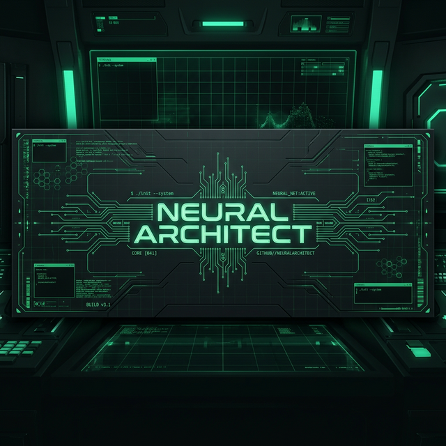

<h1 align="center">mdnaimul22 // NEURAL ARCHITECT</h1>
<p align="center">
  <code>> SYSTEM_STATUS: ONLINE</code><br>
  <code>> Anthropic Hackathon Winner | AI Agentic Systems Researcher | Vibe-Coder</code>
</p>

---

### 🟢 ACTIVE RESEARCH NODES

| Node | Objective | Status |
| :--- | :--- | :--- |
| **[Agent Piya](https://github.com/mdnaimul22/agent-piya)** | Self-evolving AI agent framework | `EVOLVING` |
| **[MetaGPT](https://github.com/mdnaimul22/MetaGPT)** | First AI Software Company / NLP Programming | `STABLE` |
| **[DGM](https://github.com/mdnaimul22/dgm)** | Darwin Gödel Machine: Self-Improving agents | `RESEARCHING` |
| **[everything-claude-code](https://github.com/mdnaimul22/everything-claude-code)** | Ultimate configuration for Claude Code | `ACTIVE` |

---

### 🛠️ SYSTEM CAPABILITIES (PROTOCOLS)

```yml
protocols:
  automation: "Agentic Workflow Orchestration"
  integration: "MCP Server Gateway & Middleware"
  optimization: "LLM Inference Proxy (Optillm)"
  logic: "Complex Prompt & Instruction Engineering"
```

---

### 📊 TELEMETRY DATA


---

### 📡 INITIATE COLLABORATION

`> deepthink@naimul:~$ ./contact.sh`

- 📧 [Email Me](mailto:naimul.work@example.com)
- 🤝 [Discuss Open-Source](https://github.com/mdnaimul22/discussions)
- 🌍 [Based in Bangladesh]

---
